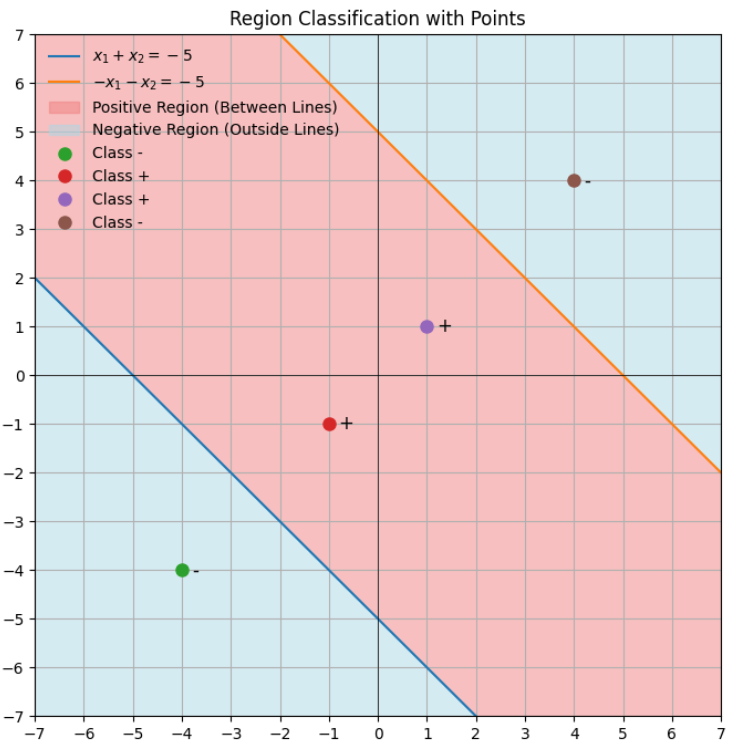
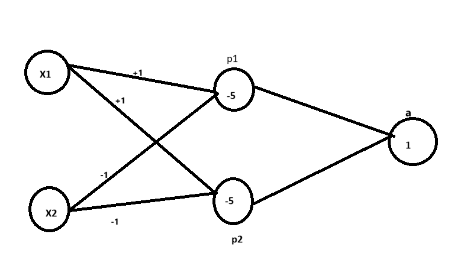
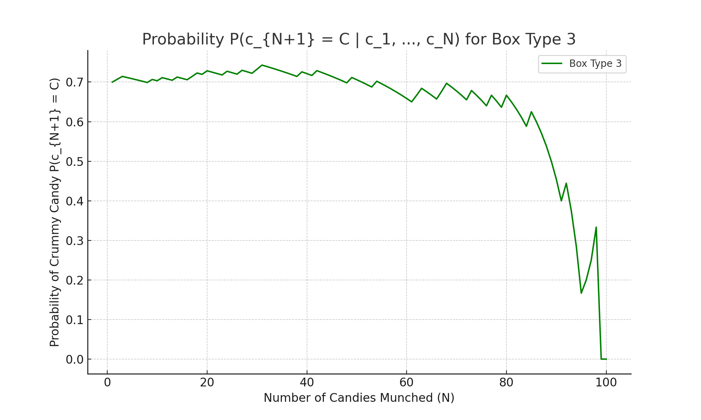
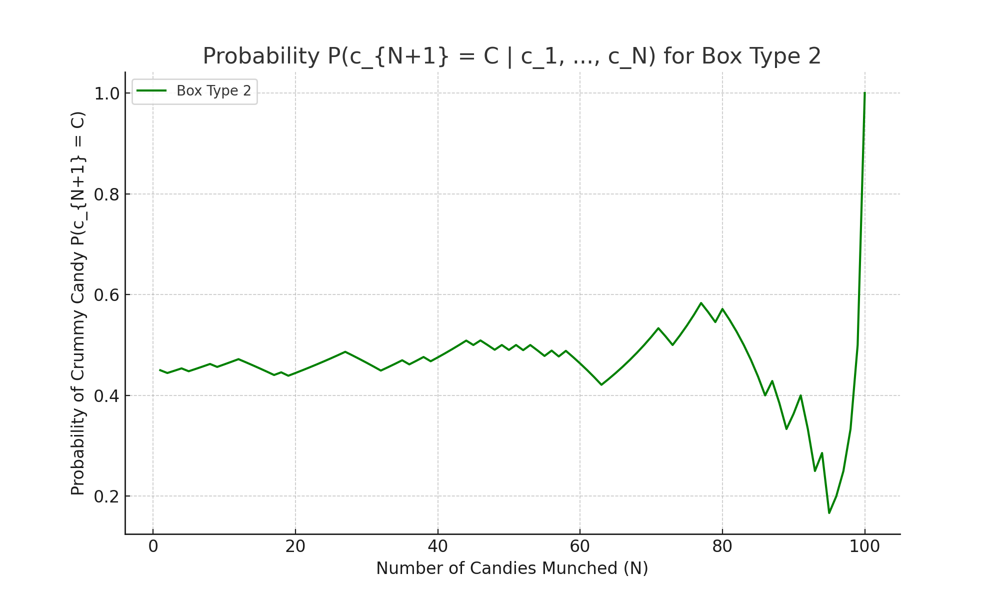
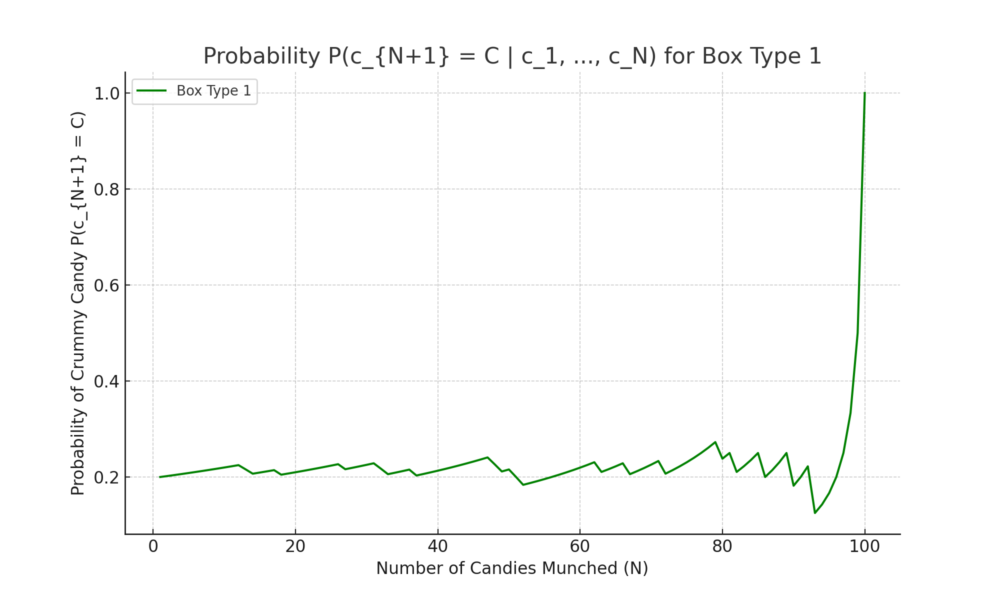
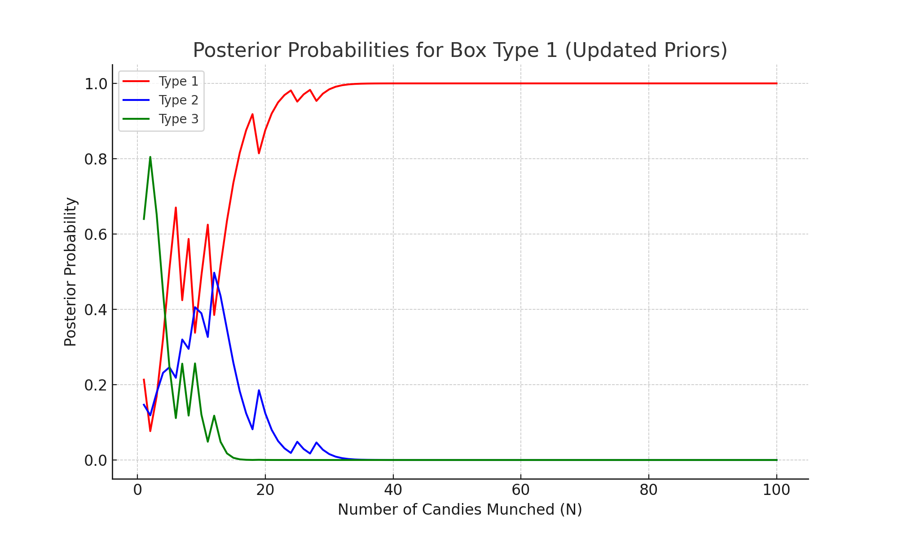
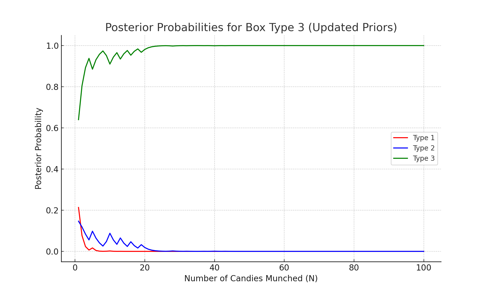
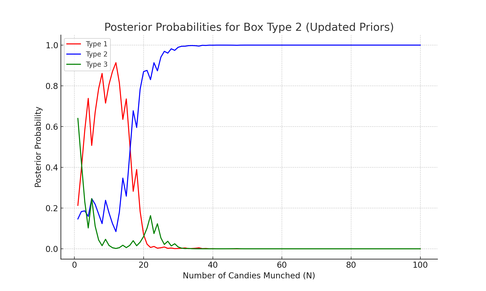

# CSDS440 Written Homework 3
**Instructions:** Each question is worth 10 points unless otherwise stated. Write your answers below the question. Each answer should be formatted so it renders properly on github. **Answers that do not render properly may not be graded.** Please comment the last commit with "FINAL COMMIT" and **enter the final commit ID in canvas by the due date.** 

When working as a group, only one answer to each question is needed unless otherwise specified. Each person in each group must commit and push their own work. **You will not get credit for work committed/pushed by someone else even if done by you.** Commits should be clearly associated with your name or CWRU ID (abc123). Each person is expected to do an approximately equal share of the work, as shown by the git logs. **If we do not see evidence of equal contribution from the logs for someone, their individual grade will be reduced.** 

Names and github IDs (if your github ID is not your name or Case ID):

1.	A function $f$ is said to have a global minimum at $x$ if for all $y$, $f(y) \geq f(x)$. It is said to have a local minimum at $x$ if there exists a neighborhood $H$ around $x$ so that for all $y$ in $H$, $f(y)\geq f(x)$. Show that, if $f$ is convex, every local minimum is a global minimum. [Hint: Prove by contradiction using Jensen’s inequality.] (10 points)

Answer: 
### Proof :-
Given:- 

A function denoted by $f$ has a global minimum at $x$ if,  $\forall$ $y$ in the domain, $f(y) \geq f(x)$.

$f$ is said to have minima at $x$, if there exists a neighborhood $H$ around $x$ such that $\forall$ $y$ in $H$, $f(y)\geq f(x)$

- For sake of contradiction,lets suppose that $f$ has local minima at $x_0$ and $f$ is convex,  but does **not** have a global minimum at $x_0$. That means that there exists some point $y \in  such that:

$$
f(y) < f(x_0).
$$

Since our assumption was that $x_0$ is a local minimum, there exists some neighborhood $H$ around $x_0$ such that $\forall$ $z \in H$:

$$
f(z) \geq f(x_0).
$$

We can parametrise any points along the line segment connecting $x_0$ and $y$ 
using $\lambda \in [0,1]$ as follows:

$$
p(\lambda) = \lambda x_0 + (1 - \lambda) y.
$$

we choose a  point in the neighborhood $z \in H$ that lies on the line segment $\lambda x_0 + (1 - \lambda) y$ and by choosing $\lambda$ close to 1, we can write
 $$
z(\lambda) = \lambda x_0 + (1 - \lambda) y.
$$

For any given neighborhood $H$ we can choose $\lambda \in [0,1]$ such that $z(\lambda) \in H$.

Since we know that of $f$ is convex, by using the Jensen’s inequality, we have:

$$
f(z(\lambda)) \leq \lambda f(x_0) + (1 - \lambda) f(y).
$$

Because $f(y) < f(x_0)$, the right-hand side becomes:

$$
\lambda f(x_0) + (1 - \lambda) f(y) < \lambda f(x_0) + (1 - \lambda) f(x_0) = f(x_0).
$$

Therefore:

$$
f(z(\lambda)) < f(x_0).
$$

However, since we have chosen $z(\lambda)$ such that $z(\lambda) \in H$ (for $\lambda$ close enough to 1)

From the definition of local minima we know that for every point in the $H$  :

$$
f(z(\lambda)) \geq f(x_0).
$$

 **we have shown both $f(z(\lambda)) < f(x_0)$ and $f(z(\lambda)) \geq f(x_0)$, which is a contradiction**

Therfore, we have proved that if $f$ is convex, every local minimum is a global minimum.

2.	Consider the LP: $\min c^Tx$ s.t. $Ax \geq b, x \geq 0$, where $T$ is the transpose, $A$ is the 4x2 matrix: \[ 0 −1; −1 −1; −1 2; 1 −1\], $b$ is a 4x1 vector \[−5; −9;0; −3\] and $c$ is a 2x1 vector \[−1; −2\]. (a) Draw the feasible region in $R^2$. (b) Draw the contours of $c^Tx =−12$, $c^Tx =−14$ and $c^Tx =−16$ and determine the solution graphically. (10 points)

Answer:

 (a) Draw the feasible region in $R^2$.

(b) Draw the contours of $c^Tx =−12$, $c^Tx =−14$ and $c^Tx =−16$ and determine the solution graphically. 

- The countours for  $c^Tx =−16$  is not not insecting the feasable region so 16 is not the minimum of $\min c^Tx$
- The countours for  $c^Tx =−14$ $c^Tx =−12$ is crossing the feasable region so the  $\min c^Tx$ is min(-12, -14 ) = -14

3.	Consider a neural network with a single hidden layer with sigmoid activation functions and a single output unit also with a sigmoid activation, and fixed weights. Show that there exists an equivalent network, which computes exactly the same function, where the hidden unit activations are the $\tanh$ function shown in class, and the output unit still has a sigmoid activation. (10 points)

Answer:

**Original Network Setup**:
Lets represent our original network as $NN_1$, and the equation is given by:

$$ 
NN_1 = \sigma \left( \sum_{i=1}^n v_i h_i + C \right)
$$

Here:
- $v_i$, $h_i$, and $C$ are all **scalars**.
- The function $\sigma$ is a sigmoid activation applied to the output.
- Here each hidden unit $h_i$ in the original network also has a sigmoid activation:
  
$$
h_i = \sigma(\mathbf{w}_i^T \mathbf{x} + b_i)
$$

Here:
- $\mathbf{w}_i$ is a **weight vector** associated with the $i$-th hidden unit.
- $\mathbf{x}$ is the **input vector**.
- $b_i$ is a **bias term**, which is also a scalar.

**Relationship Between Sigmoid and Tanh Activations**:
The following equation represents the relationship between sigmoid and $\tanh$ activations:

$$
\sigma(z) = \frac{\tanh(z/2) + 1}{2}
$$

**Substitute Relationship into Hidden Layer Activation**:
Transform the above activation $h_i$ from sigmoid to $\tanh$, we get:

$$
h_i = \frac{1}{2} \tanh\left(\frac{\mathbf{w}_i^T \mathbf{x} + b_i}{2}\right) + \frac{1}{2}
$$

**Define New Network Output with $\tanh$ Activations (Network $NN_2$)**:
Lets Define a new network, $NN_2$, where the hidden layer has $\tanh$ activations. Each hidden unit $h_i'$ is now represented by:

$$
h_i' = \tanh(\mathbf{w}_i' \cdot \mathbf{x} + b_i')
$$

and the output of $NN_2$ is given by:

$$
NN_2 = \sigma \left( \sum_{i=1}^n v_i' h_i' + c' \right)
$$

**Define New Parameters**:
To form a network with $\tanh$ activation in the hidden layer, we define following new parameters in the hidden layer:

$$
\mathbf{w}_i' = \frac{\mathbf{w}_i}{2}, \quad b_i' = \frac{b_i}{2}
$$

where $\mathbf{w}_i'$ is the modified weight vector and $b_i'$ is the modified bias term for the hidden layer.

Then, each hidden unit $h_i'$ with $\tanh$ activation can be written as:

$$
h_i = \frac{\tanh(\mathbf{w}_i' \cdot \mathbf{x} + b_i') + 1}{2} =  \frac{h_i' + 1}{2} 
$$

Now, we replace $h_i$ in the original output expression with  $\frac{h_i' + 1}{2}$ :

$$
NN_1 = \sigma \left( \sum_{i=1}^n v_i \left( \frac{h_i' + 1}{2} \right) + C \right)
$$

Expanding this expression, we get:

$$
NN_1 = \sigma \left( \sum_{i=1}^n \frac{v_i}{2} h_i' + \sum_{i=1}^n \frac{v_i}{2} + C \right)
$$

By setting

$$
\mathbf{w}_i' = \frac{\mathbf{w}_i}{2}, \quad b_i' = \frac{b_i}{2}
$$

$$
\quad v_i' = \frac{v_i}{2}, \quad c' = \sum_{i=1}^n \frac{v_i}{2} + C
$$

we satisfy $NN_1 = NN_2$.

Therefore, by using above equations for the weights and biases in the hidden layer and the output layer, with $\tanh$ activations in the hidden layer, this configuration is equivalent to the original network configuration.

4.	Draw an artificial neural network structure which can perfectly classify the examples shown in the table below. Treat attributes as continuous. Show all of the weights on the edges. For this problem, assume that the activation functions are sign functions instead of sigmoids. Propagate each example through your network and show that the classification is indeed correct.
(10 points)
 
|x1	|x2	|Class|
|---|---|-----|
|−4	|−4	|−|
|−1	|−1	|+|
| 1	| 1	|+|
| 4|  4	|−|

Answer:

From the figure, it is clear that:
- The region between two hyperplanes is the positive region.
- The region outside is the negative region.

We have to build artificial neural network that satisfies the above criteria.

Let the two hyperplanes have the following form:

### Hyperplane 1
Let $x_1$-intercept = -5, $x_2$-intercept = -5.

$$
\frac{x_1}{-5} + \frac{x_2}{-5} = 1
$$

This simplifies to:

$$
x_1 + x_2 = -5
$$

Let's construct a perceptron as $ \text{Sign}(x_1 + x_2 > - 5) $, which outputs all points where $ x_1 + x_2 = -5 $ as $ + $ and others as $ - $.

So, perceptron $ p_1 = \text{Sign}(x_1 + x_2 > - 5) = \begin{cases} 
+1 & \text{if } x_1 + x_2 > -5 \\ 
-1 & \text{if } x_1 + x_2 < -5 
\end{cases} $

### Hyperplane 2
Let $x_1$-intercept = +5, $x_2$-intercept = +5.

$$
\frac{x_1}{5} + \frac{x_2}{5} = 1
$$

This simplifies to:

$$
x_1 + x_2 = 5
$$

Let's construct a perceptron $ \text{Sign}(x_1 + x_2 < 5) $ for all points $(x, y)$ such that $ x + y < 5 $ are positive and others are negative.

So, $ p_2 = \text{Sign}(x_1 + x_2 < 5) = \text{Sign}(-x_1 + -x_2 > - 5) = \begin{cases} 
+1 & \text{if } -x_1 + -x_2 > - 5 \\ 
-1 & \text{if } -x_1 + -x_2 < - 5 
\end{cases} $

To take the intersection between the two regions where both perceptrons are positive, we need an **AND gate**.

Perceptrons:
- $ p_1 = \text{Sign}(x_1 + x_2 > - 5) $
- $ p_2 = \text{Sign}(-x_1 - x_2 > - 5) $
- $ a = \text{Sign}(x_1 + x_2 > 1) $

where, $ a = x_1 + x_2 > 1 $ is and function implmentation using peceptron.

Here’s the forward pass formatted using `$` for inline math:

#### Forward pass Calculations:

1. **For $(x_1, x_2) = (-4, -4)$**:
   $p_1 = \text{Sign}((-4) + (-4) > -5) = \text{Sign}(-8 > -5) = \text{Sign}(\text{False}) = -1$
   
   $p_2 = \text{Sign}(-(-4) - (-4) > -5) = \text{Sign}(8 > -5) = \text{Sign}(\text{True}) = 1$
   
   $a = \text{Sign}(p_1 + p_2 > 1) = \text{Sign}(-1 + 1 > 1) = \text{Sign}(0 > 1) = \text{Sign}(\text{False}) = -1$

2. **For $(x_1, x_2) = (-1, -1)$**:
   $p_1 = \text{Sign}((-1) + (-1) > -5) = \text{Sign}(-2 > -5) = \text{Sign}(\text{True}) = 1$
   
   $p_2 = \text{Sign}(-(-1) - (-1) > -5) = \text{Sign}(2 > -5) = \text{Sign}(\text{True}) = 1$
   
   $a = \text{Sign}(p_1 + p_2 > 1) = \text{Sign}(1 + 1 > 1) = \text{Sign}(2 > 1) = \text{Sign}(\text{True}) = 1$

3. **For $(x_1, x_2) = (1, 1)$**:
   $p_1 = \text{Sign}((1) + (1) > -5) = \text{Sign}(2 > -5) = \text{Sign}(\text{True}) = 1$
   
   $p_2 = \text{Sign}(-(1) - (1) > -5) = \text{Sign}(-2 > -5) = \text{Sign}(\text{True}) = 1$
   
   $a = \text{Sign}(p_1 + p_2 > 1) = \text{Sign}(1 + 1 > 1) = \text{Sign}(2 > 1) = \text{Sign}(\text{True}) = 1$

4. **For $(x_1, x_2) = (4, 4)$**:
   $p_1 = \text{Sign}((4) + (4) > -5) = \text{Sign}(8 > -5) = \text{Sign}(\text{True}) = 1$
   
   $p_2 = \text{Sign}(-(4) - (4) > -5) = \text{Sign}(-8 > -5) = \text{Sign}(\text{False}) = -1$
   
   $a = \text{Sign}(p_1 + p_2 > 1) = \text{Sign}(1 + (-1) > 1) = \text{Sign}(0 > 1) = \text{Sign}(\text{False}) = -1$

| \( x_1 \) | \( x_2 \) | \( p_1 \) | \( p_2 \) | \( a \) |
|-----------|-----------|-----------|-----------|---------|
| −4        | −4        | −1        | 1         | −1      |
| −1        | −1        | 1         | 1         | 1       |
| 1         | 1         | 1         | 1         | 1       |
| 4         | 4         | 1         | −1        | −1      |

5.	Using R/Matlab/Mathematica/python/your favorite software, plot the decision boundary for an ANN with two inputs, two hidden units and one output. All activation functions are sigmoids. Each layer is fully connected to the next. Assume the inputs range between −5 to 5 and fix all activation thresholds to 0. Plot the decision boundaries for  the weights except the thresholds randomly chosen between (i) (−10,10), (ii) (−3,3), (iii) (−0.1,0.1) (one random set for each case is enough). Use your plots to show that weight decay can be used to control overfitting for ANNs. (If you use Matlab, the following commands might be useful: meshgrid and surf). (20 points)

Answer:

6.	When learning the weights for the perceptron, we dropped the *sign* activation function to make the objective smooth. Show that the same strategy does not work for an arbitrary ANN. (Hint: consider the shape of the decision boundary if we did this.)  (10 points)

Answer:

In feed forward ANN the layer takes input either output of previous layer or input data. By using weights and bias transformation is applied . output defiend as without activation function

$h_{l} = W_{l} h_{l-1} + b_{l}$ or $h = Wx + b$(for specifc layer)

Where:
- $ h_{l} $ = the output of layer $ l $,
- $ W_{l} $ = weight matrix for layer $ l $,
- $ b_{l} $ = bias vector for layer $ l $,
- $ h_{l-1} $ = output of the previous layer  but if (or if $ l = 1 $ the $ h_{l-1} $ will be x(consider) which is input data).

    
Let us consider multiple layers and calculate $h$:

1. **1st layer output**:

   $$h_1 = W_1 x + b_1$$

2. **2nd layer output**:

   $$h_2 = W_2 h_1 + b_2 = W_2(W_1 x + b_1) + b_2 = W_2 W_1 x + W_2 b_1 + b_2$$

3. **3rd layer output**:

   $$h_3 = W_3 h_2 + b_3 = W_3(W_2 W_1 x + W_2 b_1 + b_2) + b_3 = (W_3 W_2 W_1)x + (W_3 W_2 b_1 + W_3 b_2 + b_3)$$

   which is in $Wx + b$ form which is a linear function. If we do the same for $L$ number of layers, the output will be in linear form:

    $$
    h_{L} = W_{L} W_{L-1} \dots W_{1} x + \sum_{l=1}^{L} \left( \prod_{j=l+1}^{L} W_{j} \right) b_{l}
    $$

    Le us say
    $$
    W_{\text{final layer}} = W_{L} W_{L-1} \dots W_{1}
    $$
    $$
    b_{\text{final layer}} = \sum_{l=1}^{L} \left( \prod_{j=l+1}^{L} W_{j} \right) b_{l}
    $$

Thus:

$$h_L = W_{\text{final layer}} x + b_{\text{final layer}} = Wx + b$$

Which shows us that the output of the whole network is a linear transformation of $x$, irrespective of the count of layers. A linear function means the shape of the decision boundary will be a straight line, and for any other non-linear decision boundary, the ANN won't be applicable. This means the whole network is essentially reduced to a single-layer linear model.

7.	Redo the backprop example done in class  with one iteration of gradient descent instead of two iterations of SGD as done in class. Compare the average losses after GD and SGD. Discuss the differences you observe in the weights and the losses. (10 points)

Answer: 

Let $n_j$ be net input to unit $j$.

$$
n_j = w_1 \cdot x_1 + w_3 \cdot x_2, \quad n_2 = w_2 \cdot x_2 + w_4 \cdot x_2
$$

$$
n_0 = w_5 \cdot h(n_1) + w_6 \cdot h(n_2)
$$

$$
o = h(n_0)
$$

## Forward Pass Calculation

Forward pass $(x_1, x_2, f) = (0, 0, 0)$

$$
n_1 = 0, \quad n_2 = 0
$$

$$
h(n_1) = \sigma(0) = \frac{1}{1 + e^0} = \frac{1}{2}
$$

$$
h(n_2) = \sigma(0) = \frac{1}{2}
$$

$$
n_0 = \frac{1}{2} + \frac{1}{2} = 1
$$

$$
h(n_0) = \frac{1}{1 + e^{-1}} = 0.731
$$

## For Total Gradient Descent (GD) :- 

## Gradient Calculations for Each Weight

### Gradient with Respect to $w_5$

$$
\frac{\partial L}{\partial w_5} = h(n_0)(1 - h(n_0)) \, x_{o1} (h(n_0) - y_0)
$$

Substitute values:

$$
= (0.731)(1 - 0.731) \cdot \frac{1}{2} (0.731 - 0)
$$

$$
= (0.731)(0.269) \cdot \frac{1}{2} = 0.0719
$$

### Gradient with Respect to $w_6$

$$
\frac{\partial L}{\partial w_6} = h(n_0)(1 - h(n_0)) \, x_{o2} (h(n_0) - y_0)
$$

Substitute values:

$$
= (0.731)(1 - 0.731) \cdot \frac{1}{2} = 0.0719
$$

### Gradient with Respect to $w_1$

$$
\frac{\partial L}{\partial w_1} = h(n_1)(1 - h(n_1)) \, x_1 \frac{\partial L}{\partial h(n_1)}
$$

Substitute values:

$$
= \frac{1}{2} \left(1 - \frac{1}{2}\right) \cdot 0 \cdot \left(0.0719 \cdot \frac{1}{2}\right) = 0
$$

### Gradient with Respect to $w_2$

$$
\frac{\partial L}{\partial w_2} = h(n_2)(1 - h(n_2)) \, x_2 \frac{\partial L}{\partial h(n_2)} = 0
$$

Similarly,

$$
\frac{\partial L}{\partial w_3} = 0, \quad \frac{\partial L}{\partial w_4} = 0
$$

### Forward Pass for $(x_1, x_2) = (0, 1)$

1. Calculating $n_1$ and $n_2$:
   - $n_1 = 0 + 1 = 1$
   - $n_2 = 0 + 1 = 1$
   - $h(n_1) = \frac{1}{1 + e^{-1}} = 0.731$, $h(n_2) = 0.731$

2. Calculating $n_0$:
   $$
   n_0 = (1 \cdot 0.731) + (1 \cdot 0.731) = 1.462
   $$

3. Calculating $h(n_0)$:
   $$
   h(n_0) = \sigma(1.462) = \frac{1}{1 + e^{-1.462}} = 0.8118
   $$

---

### Gradient Calculations

1. Gradient with Respect to $w_5$:
   $$
   \frac{\partial L}{\partial w_5} = h(n_0)(1 - h(n_0)) h(n_1) (h(n_0) - y_0)
   $$
   Substitute values:
   $$
   = (0.8118)(1 - 0.8118)(0.731)(0.8118 - 1) = -0.02101
   $$

2. Gradient with Respect to $w_6$:
   $$
   \frac{\partial L}{\partial w_6} = h(n_0)(1 - h(n_0)) h(n_2) (h(n_0) - y_0)
   $$
   Substitute values:
   $$
   = (0.8118)(1 - 0.8118)(0.731)(0.8118 - 1) = -0.02101
   $$

3.  Gradient with Respect to $w_1$:
   $$
   \frac{\partial L}{\partial w_1} = h(n_1)(1 - h(n_1)) x_1 \left( \frac{\partial L}{\partial w_5} \frac{w_5}{h(n_1)} \right)
   $$
   Substitute values:
   $$
   = (0.731)(1 - 0.731)(0)(-0.021) \frac{1}{0.731} = 0
   $$

4. Gradient with Respect to $w_2$:
   $$
   \frac{\partial L}{\partial w_2} = h(n_2)(1 - h(n_2)) x_1 \left( \frac{\partial L}{\partial w_6} \frac{w_6}{h(n_2)} \right)
   $$
   Substitute values:
   $$
   = (0.731)(1 - 0.731)(0) + (-0.021) \frac{1}{0.731} = 0
   $$

5.. Gradient with Respect to $w_3$:
   $$
   \frac{\partial L}{\partial w_3} = h(n_1)(1 - h(n_1)) x_1 \left( \frac{\partial L}{\partial w_5} \frac{w_5}{h(n_1)} \right)
   $$
   Substitute values:
   $$
   = (0.731)(1 - 0.731)(1)(-0.021) \frac{1}{0.731} = -0.0056
   $$

6. Gradient with Respect to $w_4$:
   $$
   \frac{\partial L}{\partial w_4} = h(n_2)(1 - h(n_2)) x_2 \left( \frac{\partial L}{\partial w_6} \frac{w_6}{h(n_2)} \right)
   $$
   Substitute values:
   $$
   = (0.731)(1 - 0.731)(1)(-0.021) \frac{1}{0.731} = -0.0056
   $$

## Weight Update for Gradient Descent (GD)

The weight update rule for gradient descent is given by:

$$
W \leftarrow W - \eta \sum_{i=1}^m \nabla W L_i
$$

where:
- $m =$ number of examples
- $L_i$ is the loss obtained when the $i$-th example is passed
- $\nabla W L_i = L(y_i, \hat{y}_i)$ represents the gradient of the loss with respect to the weights for each example $i$

---

### Expanded Form of Weight Update

$$
W = \begin{bmatrix} 1 \\ \vdots \\ \end{bmatrix} - \eta [ \begin{bmatrix} 0 \\ 0 \\ 0 \\ 0 \\ 0.0719 \\ 0.0719 \end{bmatrix} + \begin{bmatrix} 0 \\ 0 \\ -0.0056 \\ -0.0056 \\ -0.02101 \\ -0.02101 \end{bmatrix} ]
$$

$\eta = 10$

$W = \begin{bmatrix} 1\\ 1\\ 1 + 0.056 \\ 1 + 0.056 \\ 1 - 0.509 \\ 1 - 0.509 \end{bmatrix} = \begin{bmatrix}  1\\ 1\\ 1.056 \\ 1.056 \\ 0.491 \\ 0.491 \end{bmatrix}$

**Doing Forward Pass with Following Weights**

---

### Forward Pass for $(0,0)$

$n_1, n_2 = 0$, $h(n_1) = h(n_2) = \frac{1}{2} = 0.5$

$n_0 = 0.491$, $h(n_0) = \frac{1}{1 + e^{-0.491}} = 0.620$

**Forward Pass for $(0,1)$**

$n_1 = h_2 = 1.056$, $h(n_1) = h(n_2) = \frac{1}{1 + e^{-1.056}} = 0.7419$

$n_0 = 2 \cdot (0.4491) \cdot (0.7419) = 1.408$

$h(n_0) = \frac{1}{1 + e^{-1.408}} = 0.8034$

- The SGD calculation from the class:-

**SGD Forward Pass after 2 iterations**

| $x_1$ | $x_2$ | $f$ | $\hat{y}$ |
|-------|-------|-----|-----------|
| 0     | 0     | 0   | 0.5866    |
| 0     | 1     | 1   | 0.8104    |

$L_{SGD} = \frac{1}{2} \sum_{i=1}^m (y_i - \hat{y}_i)^2 = \frac{1}{2}((0.5866)^2 + (0.1896)^2) = 0.346$

---

**GD Forward Pass**

| $x_1$ | $x_2$ | $f$ | $\hat{y}$ |
|-------|-------|-----|-----------|
| 0     | 0     | 0   | 0.620     |
| 0     | 1     | 1   | 0.674     |

$L_{GD} = \frac{1}{2} \sum_{i=1}^m (y_i - \hat{y}_i)^2 = \frac{1}{2}((0.620)^2 + (0.326)^2) = 0.2453$

### 1. **Loss Comparison:**

   - **Average Loss After SGD**: $0.3467$
   - **Average Loss After GD**: $0.2454$

   **Observation**: 
   - The Toatal gradient descent(GD) has lower average loss than SGD. 
   - This happens because Total gradient descent (GD) uses all the examples to compute an gradient which is the true gradiant of the loss function rather than an approximation in the case odf SGD, leading to a more accurate adjustment in weights that minimizes the loss more effectively for the entire dataset.
   -Where as SGD, updates weights after each example which is an approximation of the true gradiant, which can lead to a noisier and less optimal loss reduction in the short term.

### 2. **Weight Updates:**

   - **Weights After SGD**: 
     $\begin{bmatrix} 1.0 \\ 1.0 \\ 1.0528502 \\ 1.0528502 \\ 0.97984755 \\ 0.97984755 \end{bmatrix}$
   - **Weights After GD**: 
     $\begin{bmatrix} 1.0 \\ 1.0 \\ 1.0565026 \\ 1.0565026 \\ 0.49141848 \\ 0.49141848 \end{bmatrix}$

   **Observation**: 
   - The weights in SGD are updated in small random steps which sometimes may increase the loss function as the the weights are updated with gradiants with single examle.
  -  SGD updates the weights based on individual examples, leading to smaller, incremental adjustments. 
  -  In contrast, Total GD, applies gradient update averaged over all examples which leads to more significant changes in the weights.

Answer 8-10 with the following scenario. The Bayesian Candy Factory makes a Halloween Candy Box that contains a mix of yummy (Y) and crummy (C) candy. You know that each Box is one of three types: 1. 80% Y and 20% C, 2. 55% Y and 45% C and 3. 30% Y and 70% C. You open a Box and start munching candies. Let the $i^{th}$ candy you munch be denoted by $c_i$. Answer the following questions using a program written in any language of your choice. Generate one Box with 100 candies for each type, and assume any fixed order of munching.
 
8.	For each Box, plot $\Pr(T=i|c_1,\ldots ,c_N)$ on a graph where $T$ represents a type and $N$ ranges from 1 to 100. (You should have three graphs and each graph will have three curves.) (10 points)

Answer:

  

9.	For each Box, plot $\Pr(c_{N+1}=C|c_1,\ldots ,c_N)$ where $N$ ranges from 1 to 99. (10 points)

Answer:

  

10.	Suppose before opening a Box you believe that each Box has 70% crummy candies (type 3) with probability 0.8 and the probability of the other two types is 0.1 each. Replot $\Pr(T=i|c_1,…,c_N)$ taking this belief into account for each of the 3 Boxes. Briefly explain the implications of your results. (10 points)

Answer: 

  

### 1. Box Type 1 Plot (First Image)

- As we start with a strong belief (with prior probability of 0.8)  that the box is Type 3, At the start Type 3 starts higher than the other two represented by the green line .
- But as more Yummy candies ( Type 1) are observed, the posterior probability for Type 1 (red line)  overtakes the others and finally converges to 1, despite the initial high prior for Type 3.
-  This plot implies that even if Type 3 has a strong prior, the accumulation of evidence of Yummy candies (Type 1) correctly shifts the belief toward Type 1.

### 2. Box Type 3 Plot (Second Image)

-  For the box of Type 3, the observed data  (more Crummy candies) aligns with the high prior for Type 3, resulting in the posterior for Type 3 (green line) converge very quickly to 1.
-  The  Type 3 posterior probability  remains close to 1, as more candies are consumed, while for Types 1 and 2 (red and blue lines) the posterior probabilities  remain close to 0.
- This plot shows if we have a strong prior that aligns with the true data  reinforces the posterior belief

### 3. Box Type 2 Plot (Third Image)

- Because of the initial sequence of candies munched contains a few Yummy candies in a row, the posterior temporarily favors Box Type 1 ctreating bump in favour of Box 1
- As we start with a strong belief (with prior probability of 0.8)  that the box is Type 3, At the start Type 3 starts higher than the other two represented by the green line .
- But as more  candies are observed, the posterior probability for Type 2 (Blue line)  overtakes the others and finally converges to 1, despite the initial high prior for Type 3.
-  This plot implies that even if Type 3 has a strong prior, the accumulation of evidence of for Type 2 correctly shifts the belief toward Type 2.
