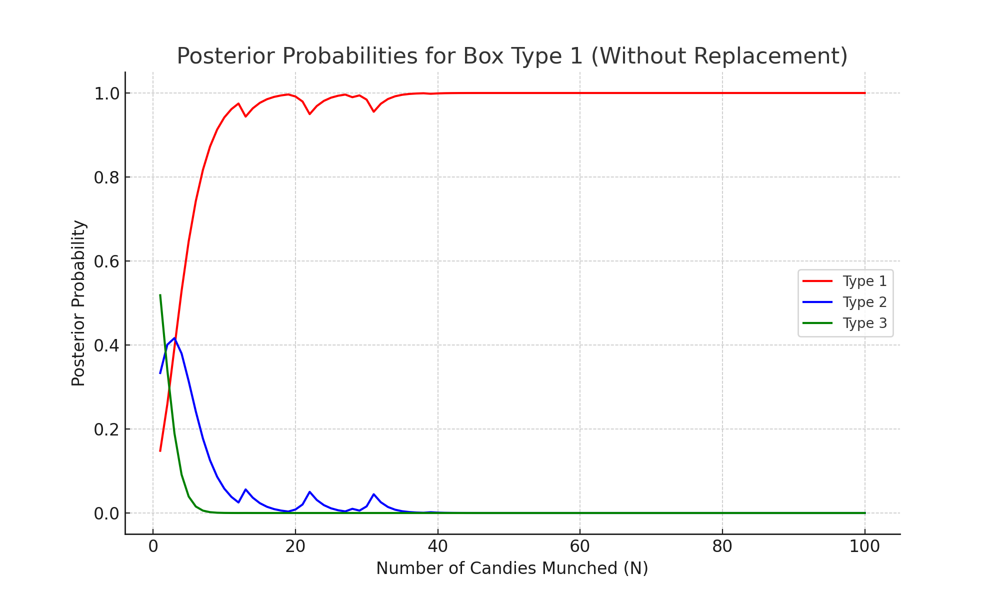

# CSDS440 Written Homework 3
**Instructions:** Each question is worth 10 points unless otherwise stated. Write your answers below the question. Each answer should be formatted so it renders properly on github. **Answers that do not render properly may not be graded.** Please comment the last commit with "FINAL COMMIT" and **enter the final commit ID in canvas by the due date.** 

When working as a group, only one answer to each question is needed unless otherwise specified. Each person in each group must commit and push their own work. **You will not get credit for work committed/pushed by someone else even if done by you.** Commits should be clearly associated with your name or CWRU ID (abc123). Each person is expected to do an approximately equal share of the work, as shown by the git logs. **If we do not see evidence of equal contribution from the logs for someone, their individual grade will be reduced.** 

Names and github IDs (if your github ID is not your name or Case ID):

1.	A function $f$ is said to have a global minimum at $x$ if for all $y$, $f(y) \geq f(x)$. It is said to have a local minimum at $x$ if there exists a neighborhood $H$ around $x$ so that for all $y$ in $H$, $f(y)\geq f(x)$. Show that, if $f$ is convex, every local minimum is a global minimum. [Hint: Prove by contradiction using Jensen’s inequality.] (10 points)

Answer: 
### Proof :-
Given:- 

A function denoted by $f$ has a global minimum at $x$ if,  $\forall$ $y$ in the domain, $f(y) \geq f(x)$.

$f$ is said to have minima at $x$, if there exists a neighborhood $H$ around $x$ such that $\forall$ $y$ in $H$, $f(y)\geq f(x)$

- For sake of contradiction,lets suppose that $f$ has local minima at $x_0$ and $f$ is convex,  but does **not** have a global minimum at $x_0$. That means that there exists some point $y \in  such that:

$$
f(y) < f(x_0).
$$

Since our assumption was that $x_0$ is a local minimum, there exists some neighborhood $H$ around $x_0$ such that $\forall$ $z \in H$:

$$
f(z) \geq f(x_0).
$$

We can parametrise any points along the line segment connecting $x_0$ and $y$ 
using $\lambda \in [0,1]$ as follows:

$$
p(\lambda) = \lambda x_0 + (1 - \lambda) y.
$$

we choose a  point in the neighborhood $z \in H$ that lies on the line segment $\lambda x_0 + (1 - \lambda) y$ and by choosing $\lambda$ close to 1, we can write
 $$
z(\lambda) = \lambda x_0 + (1 - \lambda) y.
$$

For any given neighborhood $H$ we can choose $\lambda \in [0,1]$ such that $z(\lambda) \in H$.

Since we know that of $f$ is convex, by using the Jensen’s inequality, we have:

$$
f(z(\lambda)) \leq \lambda f(x_0) + (1 - \lambda) f(y).
$$

Because $f(y) < f(x_0)$, the right-hand side becomes:

$$
\lambda f(x_0) + (1 - \lambda) f(y) < \lambda f(x_0) + (1 - \lambda) f(x_0) = f(x_0).
$$

Therefore:

$$
f(z(\lambda)) < f(x_0).
$$

However, since we have chosen $z(\lambda)$ such that $z(\lambda) \in H$ (for $\lambda$ close enough to 1)

From the definition of local minima we know that for every point in the $H$  :

$$
f(z(\lambda)) \geq f(x_0).
$$

 **we have shown both $f(z(\lambda)) < f(x_0)$ and $f(z(\lambda)) \geq f(x_0)$, which is a contradiction**

Therfore, we have proved that if $f$ is convex, every local minimum is a global minimum.

2.	Consider the LP: $\min c^Tx$ s.t. $Ax \geq b, x \geq 0$, where $T$ is the transpose, $A$ is the 4x2 matrix: \[ 0 −1; −1 −1; −1 2; 1 −1\], $b$ is a 4x1 vector \[−5; −9;0; −3\] and $c$ is a 2x1 vector \[−1; −2\]. (a) Draw the feasible region in $R^2$. (b) Draw the contours of $c^Tx =−12$, $c^Tx =−14$ and $c^Tx =−16$ and determine the solution graphically. (10 points)

Answer:

 (a) Draw the feasible region in $R^2$.

(b) Draw the contours of $c^Tx =−12$, $c^Tx =−14$ and $c^Tx =−16$ and determine the solution graphically. 

- The countours for  $c^Tx =−16$  is not not insecting the feasable region so 16 is not the minimum of $\min c^Tx$
- The countours for  $c^Tx =−14$ $c^Tx =−12$ is crossing the feasable region so the  $\min c^Tx$ is min(-12, -14 ) = -14

3.	Consider a neural network with a single hidden layer with sigmoid activation functions and a single output unit also with a sigmoid activation, and fixed weights. Show that there exists an equivalent network, which computes exactly the same function, where the hidden unit activations are the $\tanh$ function shown in class, and the output unit still has a sigmoid activation. (10 points)

Answer:

**Original Network Setup**:
Lets represent our original network as $NN_1$, and the equation is given by:

$$ 
NN_1 = \sigma \left( \sum_{i=1}^n v_i h_i + C \right)
$$

Here:
- $v_i$, $h_i$, and $C$ are all **scalars**.
- The function $\sigma$ is a sigmoid activation applied to the output.
- Here each hidden unit $h_i$ in the original network also has a sigmoid activation:
  
$$
h_i = \sigma(\mathbf{w}_i^T \mathbf{x} + b_i)
$$

Here:
- $\mathbf{w}_i$ is a **weight vector** associated with the $i$-th hidden unit.
- $\mathbf{x}$ is the **input vector**.
- $b_i$ is a **bias term**, which is also a scalar.

**Relationship Between Sigmoid and Tanh Activations**:
The following equation represents the relationship between sigmoid and $\tanh$ activations:

$$
\sigma(z) = \frac{\tanh(z/2) + 1}{2}
$$

**Substitute Relationship into Hidden Layer Activation**:
Transform the above activation $h_i$ from sigmoid to $\tanh$, we get:

$$
h_i = \frac{1}{2} \tanh\left(\frac{\mathbf{w}_i^T \mathbf{x} + b_i}{2}\right) + \frac{1}{2}
$$

**Define New Network Output with $\tanh$ Activations (Network $NN_2$)**:
Lets Define a new network, $NN_2$, where the hidden layer has $\tanh$ activations. Each hidden unit $h_i'$ is now represented by:

$$
h_i' = \tanh(\mathbf{w}_i' \cdot \mathbf{x} + b_i')
$$

and the output of $NN_2$ is given by:

$$
NN_2 = \sigma \left( \sum_{i=1}^n v_i' h_i' + c' \right)
$$

**Define New Parameters**:
To form a network with $\tanh$ activation in the hidden layer, we define following new parameters in the hidden layer:

$$
\mathbf{w}_i' = \frac{\mathbf{w}_i}{2}, \quad b_i' = \frac{b_i}{2}
$$

where $\mathbf{w}_i'$ is the modified weight vector and $b_i'$ is the modified bias term for the hidden layer.

Then, each hidden unit $h_i'$ with $\tanh$ activation can be written as:

$$
h_i = \frac{\tanh(\mathbf{w}_i' \cdot \mathbf{x} + b_i') + 1}{2} =  \frac{h_i' + 1}{2} 
$$

Now, we replace $h_i$ in the original output expression with  $\frac{h_i' + 1}{2}$ :

$$
NN_1 = \sigma \left( \sum_{i=1}^n v_i \left( \frac{h_i' + 1}{2} \right) + C \right)
$$

Expanding this expression, we get:

$$
NN_1 = \sigma \left( \sum_{i=1}^n \frac{v_i}{2} h_i' + \sum_{i=1}^n \frac{v_i}{2} + C \right)
$$

By setting

$$
\mathbf{w}_i' = \frac{\mathbf{w}_i}{2}, \quad b_i' = \frac{b_i}{2}
$$

$$
\quad v_i' = \frac{v_i}{2}, \quad c' = \sum_{i=1}^n \frac{v_i}{2} + C
$$

we satisfy $NN_1 = NN_2$.

Therefore, by using above equations for the weights and biases in the hidden layer and the output layer, with $\tanh$ activations in the hidden layer, this configuration is equivalent to the original network configuration.

4.	Draw an artificial neural network structure which can perfectly classify the examples shown in the table below. Treat attributes as continuous. Show all of the weights on the edges. For this problem, assume that the activation functions are sign functions instead of sigmoids. Propagate each example through your network and show that the classification is indeed correct.
(10 points)
 
|x1	|x2	|Class|
|---|---|-----|
|−4	|−4	|−|
|−1	|−1	|+|
| 1	| 1	|+|
| 4|  4	|−|

Answer:

5.	Using R/Matlab/Mathematica/python/your favorite software, plot the decision boundary for an ANN with two inputs, two hidden units and one output. All activation functions are sigmoids. Each layer is fully connected to the next. Assume the inputs range between −5 to 5 and fix all activation thresholds to 0. Plot the decision boundaries for  the weights except the thresholds randomly chosen between (i) (−10,10), (ii) (−3,3), (iii) (−0.1,0.1) (one random set for each case is enough). Use your plots to show that weight decay can be used to control overfitting for ANNs. (If you use Matlab, the following commands might be useful: meshgrid and surf). (20 points)

Answer:

6.	When learning the weights for the perceptron, we dropped the *sign* activation function to make the objective smooth. Show that the same strategy does not work for an arbitrary ANN. (Hint: consider the shape of the decision boundary if we did this.)  (10 points)

Answer:

7.	Redo the backprop example done in class  with one iteration of gradient descent instead of two iterations of SGD as done in class. Compare the average losses after GD and SGD. Discuss the differences you observe in the weights and the losses. (10 points)

Answer: 

Answer 8-10 with the following scenario. The Bayesian Candy Factory makes a Halloween Candy Box that contains a mix of yummy (Y) and crummy (C) candy. You know that each Box is one of three types: 1. 80% Y and 20% C, 2. 55% Y and 45% C and 3. 30% Y and 70% C. You open a Box and start munching candies. Let the $i^{th}$ candy you munch be denoted by $c_i$. Answer the following questions using a program written in any language of your choice. Generate one Box with 100 candies for each type, and assume any fixed order of munching.
 
8.	For each Box, plot $\Pr(T=i|c_1,\ldots ,c_N)$ on a graph where $T$ represents a type and $N$ ranges from 1 to 100. (You should have three graphs and each graph will have three curves.) (10 points)

Answer:

  

9.	For each Box, plot $\Pr(c_{N+1}=C|c_1,\ldots ,c_N)$ where $N$ ranges from 1 to 99. (10 points)

Answer:

10.	Suppose before opening a Box you believe that each Box has 70% crummy candies (type 3) with probability 0.8 and the probability of the other two types is 0.1 each. Replot $\Pr(T=i|c_1,…,c_N)$ taking this belief into account for each of the 3 Boxes. Briefly explain the implications of your results. (10 points)

Answer: 
